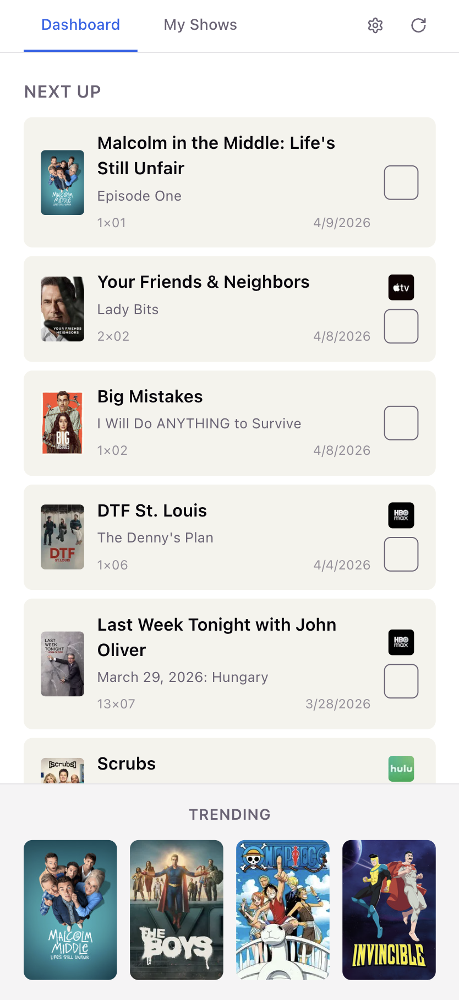
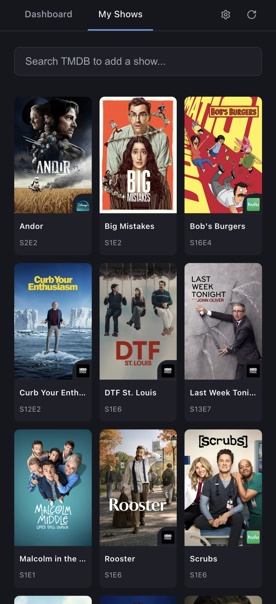

# streamd

TV show tracker for managing shows across streaming services. Lightweight name-based login — no passwords, no accounts.

<p align="center">
  
  &nbsp;&nbsp;
  
</p>

## What It Does

- **Search and add** TV shows from TMDB's catalog
- **Track your progress** — mark episodes watched and your bookmark auto-advances
- **Dashboard** shows your next unwatched episodes across all shows, sorted by air date
- **Episode sync** pulls new episode data from TMDB automatically (or on demand)
- **Multiple users** on the same instance with isolated watch progress — shows and episode metadata are shared, but what you're watching and where you're at is yours
- **Streaming providers** displayed per show so you know where to watch

## Tech Stack

- React 19 & TypeScript & Vite+ (unified toolchain: Vite & Vitest & Oxlint)
- Cloudflare Pages (frontend + API)
- Cloudflare D1 (SQLite database)
- TMDB API (show metadata)
- MSW (API mocking for dev/tests)

## Local Development

```bash
# Install dependencies
npm install

# Start dev server (frontend + API + D1)
npm run dev

# Start with mock API (no wrangler needed)
npm run dev:mock

# Reset local database and start fresh
npm run db:reset
```

Dev server runs at http://localhost:5173 (API proxied to port 8788)

## Scripts

| Command            | Description                               |
| ------------------ | ----------------------------------------- |
| `npm run dev`      | Vite + Wrangler concurrently (full stack) |
| `npm run dev:mock` | Vite only with MSW mock API               |
| `npm run build`    | Build for production                      |
| `npm start`        | Serve production build locally            |
| `npm run db:reset` | Wipe local DB and restart                 |
| `npm run lint`     | Lint with Oxlint (via Vite+)              |
| `npm test`         | Run tests in watch mode                   |
| `npm run test:run` | Run tests once                            |

## Environment Variables

Create `.env.local` for local development (gitignored):

```
TMDB_API_KEY=your_key_here
```

For production, set `TMDB_API_KEY` in Cloudflare Pages dashboard under Settings → Environment variables.

## Cloudflare Deployment

### First-time setup

1. Create a Cloudflare account
2. Create D1 database:
   ```bash
   npx wrangler login
   npx wrangler d1 create streamd-db
   ```
3. Update `wrangler.toml` with the database_id from step 2
4. Connect your GitHub repo to Cloudflare Pages:
   - Dashboard → Workers & Pages → Create → Pages → Connect to Git
   - Build command: `npm run build`
   - Output directory: `dist`
5. Add D1 binding in Pages settings:
   - Settings → Functions → D1 database bindings
   - Variable name: `DB`
   - Database: `streamd-db`

### Deploying updates

Push to main — Cloudflare auto-deploys. CI runs lint, tests, and build on PRs.

## Attribution

This product uses the TMDB API but is not endorsed or certified by TMDB.
